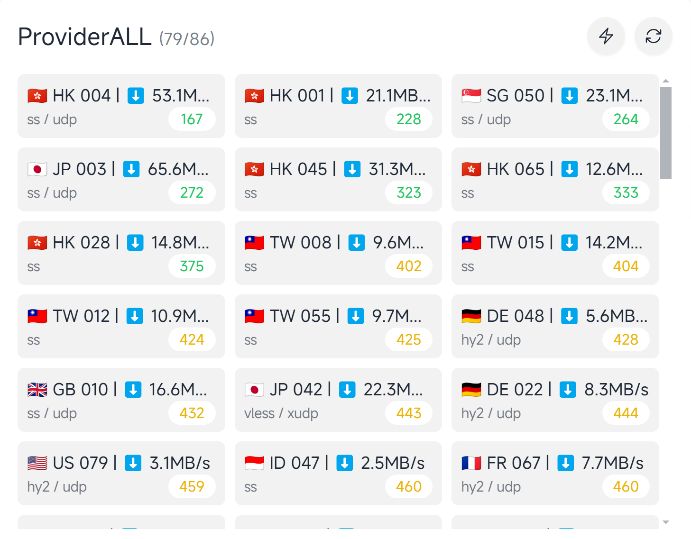

# Subscription Merge and Conversion Detection Tool

<div align="center">
  
  
  <a href="./README_zh.md">
    
  </a>
  
</div>

## Preview



## Features

- ✅ Detect node availability and remove unavailable nodes
- ✅ Custom platform unlocking detection
    - openai
    - youtube
    - netflix
    - disney
- ✅ Merge multiple subscriptions
- ✅ Convert subscriptions to clash/mihomo format
- ✅ Remove duplicate nodes
- ✅ Rename nodes
    - API naming
    - Custom rule naming
- ✅ Test node speed
- ✅ Classify and save based on unlocking status

## Characteristics

- 🚀 Supports multiple platforms
- ⚡ Supports multithreading
- 🍃 Low resource consumption

## TODO

- [x] Adapt to various subscription formats
- [ ] Support more saving methods
    - [x] Local
    - [x] cloudflare r2
    - [x] gist
    - [x] webdav
    - [x] http
    - [ ] Others

## Usage

### Docker

```bash
docker run -itd \
    --name bestsub \
    -p 8080:8080 \
    -v /path/to/config:/app/config \
    -v /path/to/output:/app/output \
    --restart=always \
    ghcr.io/bestruirui/bestsub
```

### Run from Source Code

```bash
go run main.go -f /path/to/config.yaml
```
### Config Description

[Config Description](./doc/config.md)

### Run Binary File

Just run it, and a configuration file will be generated in the current directory.

### Self-hosted Speed Test Address

- Deploy the [worker](./doc/cloudflare/worker.js) to Cloudflare Workers

- Set `speed-test-url` to your worker address

```yaml
speed-test-url: https://your-worker-url/speedtest?bytes=1000000
```

### Save Method Configuration

- 📁 Local Save: Save results locally, default to the output folder in the executable file directory.
- ☁️ r2: Save results to Cloudflare R2 bucket [Configuration Method](./doc/r2.md)
- 💾 gist: Save results to GitHub Gist [Configuration Method](./doc/gist.md)
- 🌐 webdav: Save results to webdav server [Configuration Method](./doc/webdav.md)

### Subscription Usage Method

It is recommended to run in bare metal mode directly.

My own bare metal application for Windows [minihomo](https://github.com/bestruirui/minihomo)

- Download [base.yaml](./doc/base.yaml)
- Replace the corresponding links in the file with your own.

For example:

```yaml
proxy-providers:
  ProviderALL:
    url: https:// # Replace this with your own link
    type: http
    interval: 600
    proxy: DIRECT
    health-check:
      enable: true
      url: http://www.google.com/generate_204
      interval: 60
    path: ./proxy_provider/ALL.yaml
``` 