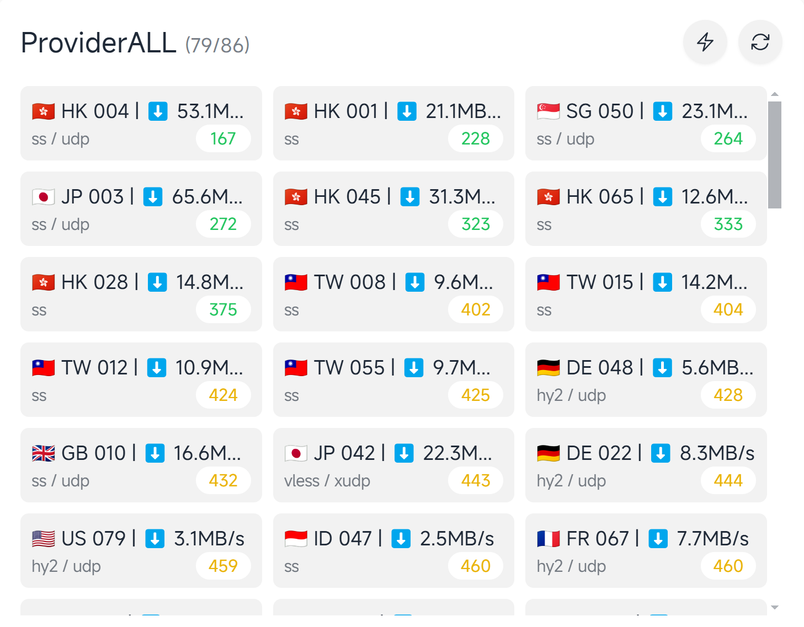

# 订阅合并转换检测工具

<div align="center">
  
  
  <a href="./README.md">
    
  </a>
  
</div>

## 预览



## 功能

- ✅ 检测节点可用性，去除不可用节点
- ✅ 自定义检测平台解锁情况
    - openai
    - youtube
    - netflix
    - disney
- ✅ 合并多个订阅
- ✅ 将订阅转换为clash/mihomo格式
- ✅ 节点去重
- ✅ 节点重命名
    - API命名
    - 自定义规则命名
- ✅ 节点测速
- ✅ 根据解锁情况分类保存

## 特点

- 🚀 支持多平台
- ⚡ 支持多线程
- 🍃 资源占用低

## TODO

- [x] 适配多种订阅格式
- [ ] 支持更多的保存方式
    - [x] 本地
    - [x] cloudflare r2
    - [x] gist
    - [x] webdav
    - [x] http
    - [ ] 其他


## 配置文件详解

[配置文件详解](./doc/config_zh.md)


## 使用方法

### Docker

```bash
mkdir -p /path/to/config
````

```bash
wget https://raw.githubusercontent.com/bestruirui/BestSub/master/doc/config.example.yaml -O /path/to/config/config.yaml
```
```bash
wget https://raw.githubusercontent.com/bestruirui/BestSub/master/doc/rename.yaml -O /path/to/config/rename.yaml
```


```bash
docker run -itd \
    --name bestsub \
    -p 8080:8080 \
    -v /path/to/config:/app/config \
    -v /path/to/output:/app/output \
    --restart=always \
    ghcr.io/bestruirui/bestsub
```

### 源码直接运行

```bash
go run main.go -f /path/to/config.yaml
```


### 二进制文件运行

1. 根据自己系统选择 [release](https://github.com/bestruirui/BestSub/releases) 中的文件
2. 下载[config.example.yaml](https://raw.githubusercontent.com/bestruirui/BestSub/master/doc/config.example.yaml) 和 [rename.yaml](https://raw.githubusercontent.com/bestruirui/BestSub/master/doc/rename.yaml) 文件 到 `config` 文件夹中
3. 按自己需求修改配置文件后，重命名为 `config.yaml`
4. 运行即可

### 自建测速地址

- 将 [worker](./doc/cloudflare/worker.js) 部署到 Cloudflare Workers

- 将 `speed-test-url` 配置为你的 worker 地址

```yaml
speed-test-url: https://your-worker-url/speedtest?bytes=1000000
```

### 保存方法配置

- 📁 本地保存：将结果保存到本地，默认保存到可执行文件目录下的 output 文件夹
- ☁️ r2：将结果保存到 Cloudflare R2 存储桶 [配置方法](./doc/r2_zh.md)
- 💾 gist：将结果保存到 GitHub Gist [配置方法](./doc/gist_zh.md)
- 🌐 webdav：将结果保存到 webdav 服务器 [配置方法](./doc/webdav_zh.md)

### 订阅使用方法

推荐直接裸核运行 tun 模式

我自己写的Windows下的裸核运行应用 [minihomo](https://github.com/bestruirui/minihomo)

- 下载 [base.yaml](./doc/base.yaml)
- 将文件中对应的链接改为自己的即可

例如:

```yaml
proxy-providers:
  ProviderALL:
    url: https:// # 将此处替换为自己的链接
    type: http
    interval: 600
    proxy: DIRECT
    health-check:
      enable: true
      url: http://www.google.com/generate_204
      interval: 60
    path: ./proxy_provider/ALL.yaml
```